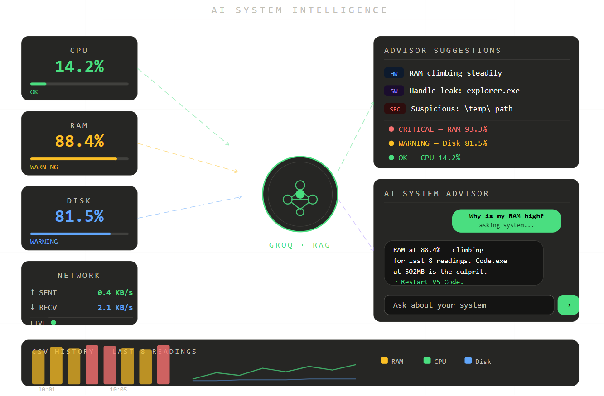

# 🤖 SysWatch — AI Powered System Intelligence

<div align="center">


<br>



</div>
---

# 📌 Overview

SysWatch is an intelligent real-time monitoring system that combines:

* ⚡ Live system monitoring
* 🧠 AI-powered advisory insights
* 📈 Trend analysis
* 🚨 Smart anomaly detection
* 🔍 Software issue detection
* 💬 RAG-based AI assistant

Instead of only displaying CPU/RAM numbers, SysWatch explains:

> **What is happening, why it is happening, and what to do next.**

---

# ✨ Core Features

<div align="center">

| Feature                 | Description                                                   |
| ----------------------- | ------------------------------------------------------------- |
| 📊 Real-Time Dashboard  | Live CPU, RAM, Disk, Network monitoring                       |
| 🚨 Smart Alerts         | Detects warnings and critical state transitions               |
| 🧠 AI Advisor           | Generates human-readable optimization suggestions             |
| 📈 Historical Analysis  | Tracks metrics over time using CSV storage                    |
| 🔍 Software Detection   | Detects memory leaks, thread explosions, suspicious processes |
| 💬 AI Chat              | RAG-powered contextual assistant using system history         |
| ⚡ Fast APIs             | Flask backend with optimized routes and caching               |
| 🧪 Evaluation Framework | Precision, Recall, F1, Latency benchmarking                   |

</div>

---

# 🧠 Architecture

```text
sys_watcher/
│
├── app.py                  # Flask backend and APIs
├── snapshot.py             # System metrics collection
├── advisor.py              # AI advisory engine
├── software_detector.py    # Software issue detection
├── storage.py              # CSV storage utilities
├── monitor.py              # Terminal monitoring mode
│
├── templates/
│   └── index.html          # Frontend dashboard
│
├── evaluation/
│   ├── evaluate.py         # Evaluation framework
│   └── test_cases.json     # Ground truth cases
│
├── metrics.csv
├── anomalies.csv
├── .env
└── README.md
```

---

# 🚀 Quick Start

## 1️⃣ Clone Repository

```bash
git clone https://github.com/ramyadjoshi/System-Watcher.git
cd System-Watcher
```

---

## 2️⃣ Install Dependencies

```bash
pip install flask psutil python-dotenv requests rich
```

---

## 3️⃣ Add Environment Variables

Create a `.env` file:

```env
GROQ_API_KEY=your_api_key_here
```

---

## 4️⃣ Run Application

```bash
python app.py
```

Open browser:

```text
http://127.0.0.1:5000
```

---

# 🌐 API Endpoints

| Endpoint         | Purpose                     |
| ---------------- | --------------------------- |
| `/api/metrics`   | Live CPU/RAM/Disk metrics   |
| `/api/processes` | Top RAM-consuming processes |
| `/api/network`   | Network statistics          |
| `/api/history`   | Historical CSV data         |
| `/api/anomalies` | Logged anomaly events       |
| `/api/advisor`   | AI-generated system advice  |
| `/api/chat`      | RAG-based AI assistant      |

---

# 📊 Evaluation Metrics

SysWatch includes an evaluation framework for measuring:

* ✅ Precision
* ✅ Recall
* ✅ F1 Score
* ✅ Latency
* ✅ Advisor relevance

## 📈 Latest Results

```text
Precision : 1.0000
Recall    : 1.0000
F1 Score  : 1.0000

Average Latency : 269ms
Advisor Relevance : 0.56
```

---

# 🛠️ Tech Stack

<div align="center">

| Layer         | Technology          |
| ------------- | ------------------- |
| Backend       | Flask + Python      |
| Monitoring    | psutil              |
| AI            | Groq + Llama 3.1    |
| Frontend      | HTML/CSS/JavaScript |
| Visualization | Chart.js            |
| Terminal UI   | Rich                |
| Storage       | CSV                 |

</div>

---

# 🔍 Detection Capabilities

```text
🔴 Critical CPU spikes
🟡 High RAM consumption
🔴 Disk nearing full capacity
🟡 Memory leak suspects
🔴 Handle leaks
🟡 Thread explosions
🔴 Suspicious process locations
```

---

# 🔐 Security

* ✅ Runs locally
* ✅ Environment variables protected via `.env`
* ✅ No telemetry
* ✅ Read-only monitoring
* ✅ Sensitive files excluded using `.gitignore`

---

# 🗺️ Future Improvements

* [ ] Predictive crash analysis
* [ ] Email/desktop notifications
* [ ] Docker deployment
* [ ] Multi-machine monitoring
* [ ] PDF system reports
* [ ] ML-based anomaly prediction

---

# 👩‍💻 Author

<div align="center">

## Ramya Dattaraj Joshi

### Software Engineer • AI Systems Enthusiast

Built as part of advanced system intelligence and GenAI experimentation.

<br>

<a href="https://github.com/ramyadjoshi">

</a>

</div>

---

<div align="center">

## ⭐ If you found SysWatch interesting, consider starring the repository.


</div>
